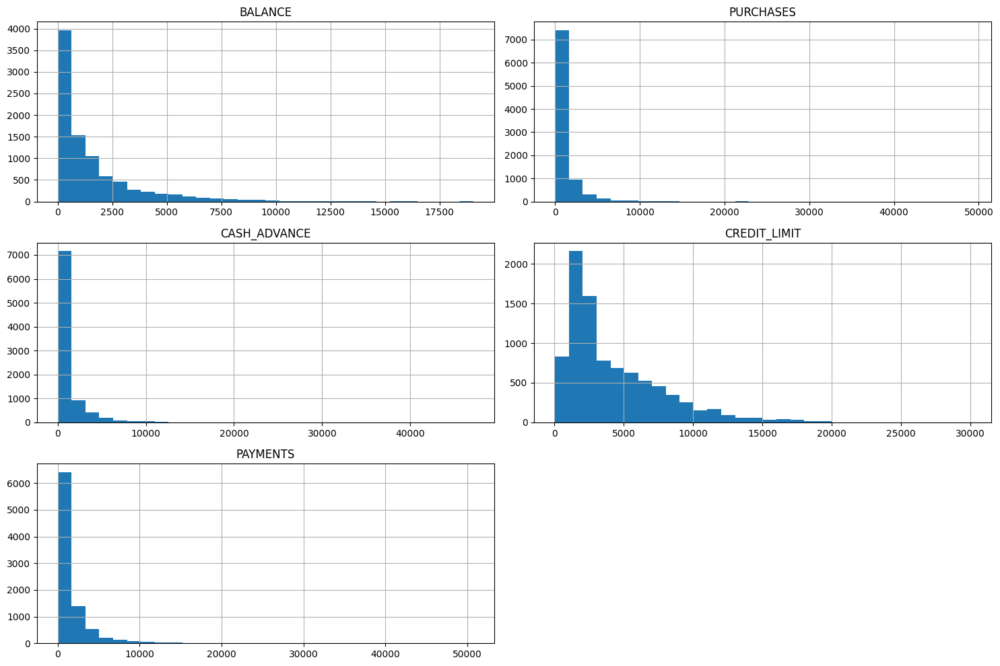
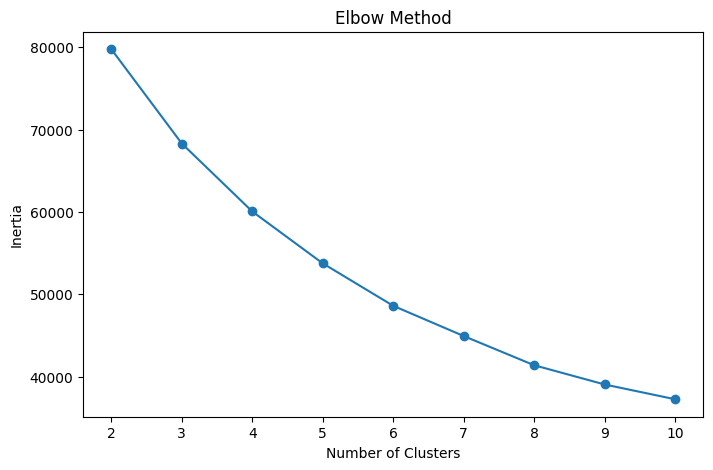
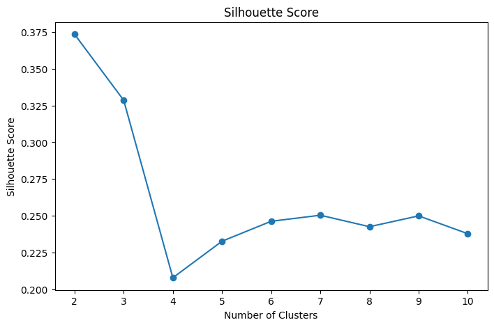
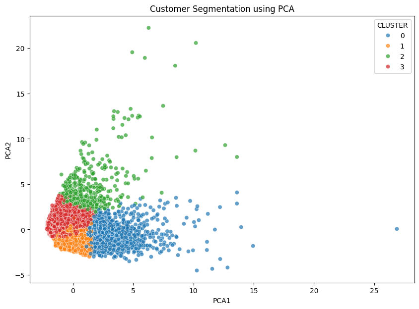
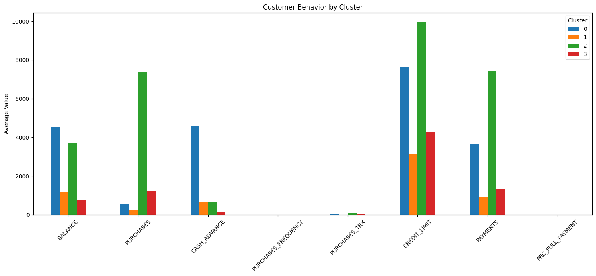

# Credit Card Customer Segmentation

## Project Overview

Project ini menganalisis perilaku penggunaan kartu kredit dari 8.950 pelanggan menggunakan Python dan K-Means Clustering. Analisis dilakukan untuk mengidentifikasi kelompok pelanggan berdasarkan pola transaksi, penggunaan kredit, pembayaran, dan aktivitas penggunaan kartu.

## Objective

Mengidentifikasi karakteristik dan pola perilaku pelanggan untuk membentuk segmentasi pelanggan yang dapat digunakan sebagai dasar dalam memahami kebutuhan dan strategi layanan yang berbeda.

## Dataset

Dataset yang digunakan adalah **Credit Card Dataset for Clustering** dari Kaggle.

Dataset berisi informasi perilaku penggunaan kartu kredit pelanggan selama periode 6 bulan, mencakup aktivitas pembelian, cash advance, pembayaran, frekuensi transaksi, dan credit limit.

**Source:** Kaggle — Credit Card Dataset for Clustering

## Methodology

Analisis dilakukan melalui beberapa tahapan:

1. Data Understanding
2. Data Cleaning
3. Exploratory Data Analysis (EDA)
4. Feature Engineering
5. Feature Scaling
6. K-Means Clustering
7. Cluster Evaluation
8. Customer Profiling
9. Business Insights

## Data Cleaning

Beberapa proses preprocessing yang dilakukan:

* Memeriksa struktur dan tipe data
* Menangani missing values pada `CREDIT_LIMIT` dan `MINIMUM_PAYMENTS`
* Memeriksa duplicate records dan duplicate customer ID
* Mengevaluasi distribusi variabel numerik
* Menyiapkan fitur yang relevan untuk proses clustering

## Feature Engineering

Beberapa fitur tambahan dibuat untuk membantu memahami pola perilaku pelanggan, antara lain:

* Total Purchase Activity
* Total Transaction Activity
* Purchase to Credit Limit Ratio
* Payment to Balance Ratio

Fitur yang digunakan dalam proses clustering kemudian dipilih berdasarkan relevansi terhadap perilaku penggunaan kartu kredit.

## Clustering

Metode **K-Means Clustering** digunakan untuk mengelompokkan pelanggan berdasarkan kemiripan karakteristik perilaku.

Jumlah cluster dievaluasi menggunakan:

* Elbow Method
* Silhouette Score

Hasil analisis menghasilkan **4 customer segments**.

## Customer Segments

| Segment                | Customer Count | Description                                                                                                     |
| ---------------------- | -------------: | --------------------------------------------------------------------------------------------------------------- |
| Cash Advance Dependent |          1,184 | Pelanggan dengan penggunaan cash advance relatif tinggi dan frekuensi pembelian rendah                          |
| Low Engagement         |          3,860 | Pelanggan dengan aktivitas transaksi dan penggunaan kartu relatif rendah                                        |
| High-Value Active      |            413 | Pelanggan dengan aktivitas pembelian dan transaksi paling tinggi                                                |
| Frequent Responsible   |          3,493 | Pelanggan dengan frekuensi pembelian tinggi, balance relatif rendah, dan proporsi pembayaran penuh lebih tinggi |

## Key Insights

* **Low Engagement** merupakan segment terbesar dengan sekitar 43% dari keseluruhan pelanggan.
* **Frequent Responsible** mencakup sekitar 39% pelanggan dan menunjukkan aktivitas pembelian yang tinggi dengan balance relatif rendah.
* **Cash Advance Dependent** memiliki penggunaan cash advance yang paling tinggi dibandingkan segment lainnya.
* **High-Value Active** merupakan segment terkecil, tetapi menunjukkan aktivitas pembelian, frekuensi transaksi, dan nilai pembayaran yang paling tinggi.

## Business Recommendations

Berdasarkan karakteristik setiap segment, pendekatan yang berbeda dapat dipertimbangkan:

* **Low Engagement:** meningkatkan engagement melalui campaign yang relevan dan personalized offers.
* **Frequent Responsible:** mempertahankan loyalitas melalui rewards dan program apresiasi.
* **High-Value Active:** memberikan program premium atau benefit khusus untuk mempertahankan pelanggan bernilai tinggi.
* **Cash Advance Dependent:** memberikan edukasi dan pendekatan layanan yang sesuai dengan pola penggunaan cash advance.

## Tools

* Python
* Pandas
* NumPy
* Matplotlib
* Seaborn
* Scikit-learn
* Google Colab

## Project Output

### Exploratory Data Analysis

### Elbow Method

### Silhouette Score

### Customer Segmentation

### Cluster Profile

